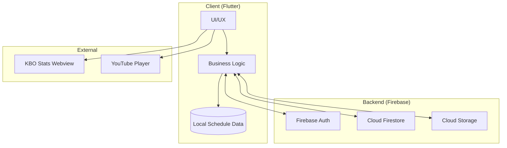

# ⚾갈래말래 - KBO 실시간 직관 매칭 플랫폼

<p align="center">
  
  
  
</p>

---

### 📝 프로젝트 소개
> **"혼자 가기 망설여지는 야구장, 이제 취향 맞는 파트너와 함께"**
> 
> **갈래말래**는 KBO 경기 일정을 기반으로 직관 동행을 찾고, 실시간으로 소통하며 야구 데이터를 확인하는 올인원 소셜 플랫폼. 1,200만 관중 시대의 니즈를 반영하여 **[탐색-매칭-소통]**의 전 과정을 앱 내에서 원스톱으로 제공.

---

## ✨ 주요 기능 (Key Features)

### 1️⃣ 스마트 직관 매칭
* **경기 일정 캘린더**: 크롤링을 통해 내장된 2025/2026 시즌 데이터를 통해 경기 일정 및 결과 조회.
* **맞춤형 파티 탐색**: 좌석 선호도, 응원 성향 태그별 파티 필터링.
* **실시간 매칭**: 클릭 한 번으로 파티 참여 및 방 개설 가능.

### 2️⃣ 다층적 커뮤니티
* **파티 전용 채팅**: 매칭된 인원끼리만 대화하는 프라이빗 채팅방.
* **경기 당일 전체 채팅**: 해당 경기에 관심 있는 모든 유저가 참여하는 오픈 채팅.
* **팬 게시판**: VLOG 후기, 맛집 공유, 티켓 양도 정보를 위한 카테고리별 게시판.

### 3️⃣ 스마트 정보 제공
* **실시간 스탯 조회**: 외부 KBO 기록실 및 티켓 예매처 웹뷰(WebView) 연동.
* **미디어 재생**: 유튜브 API를 활용한 직관 VLOG 영상 앱 내 재생.

---

## 🏗 시스템 구조 (Architecture)



---

## 📂 프로젝트 구조 (Project Structure)

```text
lib/
├── data/           # 내장 경기 일정 데이터 (season_2025.dart)
├── models/         # 데이터 모델 (user_model.dart, match_model.dart)
├── screens/        # UI 화면 (home, chat, board, webview_screen)
├── services/       # Firebase 연동 및 서비스 로직
└── widgets/        # 재사용 위젯 (chat_bubble, post_card)

```

---

## 🚀 시작하기 (Getting Started)

### 1. 환경 설정

* Flutter SDK (3.2.0 이상)
* Firebase 프로젝트 연동 (`google-services.json` 설정 필요)

### 2. 설치 및 실행

```bash
# 저장소 클론
git clone [https://github.com/username/project-name.git](https://github.com/username/project-name.git)

# 패키지 설치
flutter pub get

# 앱 실행
flutter run

```

---

## 📈 한계점 및 향후 계획

* **실시간 API 연동**: 로컬 데이터 방식을 탈피하여 공공데이터 API 실시간 연동 추진.
* **신뢰 시스템**: 사용자 매너 온도 및 리뷰 시스템 도입을 통한 매칭 신뢰도 강화.
* **수익 모델**: 구장 인근 상권 연계 및 티켓 예매 수수료 모델 기획.

---

## 📄 License

Copyright © 2025 (직관)갈래말래 Team. All rights reserved.

```

### 💡 깔끔하게 배치하는 팁
1. **파일 확장자**: 반드시 파일명을 `README.md`로 만드셔야 합니다.
2. **Mermaid 지원**: GitHub는 위 코드에 포함된 `mermaid` 다이어그램을 자동으로 그림으로 변환해 보여줍니다. 
3. **이미지 추가**: 실제 앱 스크린샷이 있다면 `` 형식을 사용하여 `## 주요 기능` 아래에 추가하면 훨씬 보기 좋습니다.

이 마크다운 코드를 그대로 복사해서 사용해 보시겠어요? 혹시 특정 부분이 여전히 이상하게 보인다면 어느 부분인지 말씀해 주세요!

```
