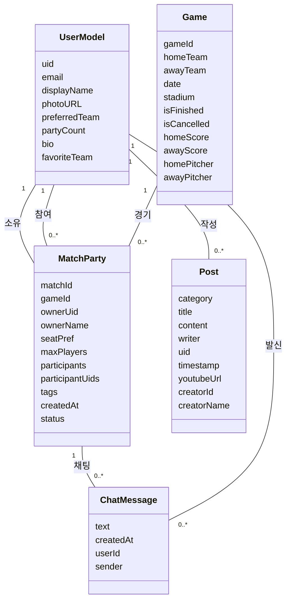

제안해주신 '갈래말래' 프로젝트 최종보고서 내용을 바탕으로, 가독성을 높이고 핵심 내용을 강조하여 보다 상세하게 정리해 드립니다.

---

# [오픈소스 프로젝트 최종보고서] 갈래말래 (Galae Malae)

**개발 기간:** 2025. 10. 20 ~ 2025. 12. 10 (2개월) **팀 명:** FLC 

---

1. 프로젝트 개요 

* 1) 개발 배경 및 필요성 

* **젊은 팬덤으로의 재편:** KBO 리그는 1,200만 관중 시대를 맞이하며, MZ세대(2030)가 전체의 83%를 차지하는 활발한 소셜 엔터테인먼트 공간이 되었습니다.

* **현실적 제약 존재:** 폭발적인 관심에도 불구하고 야구에 관심 없는 지인을 섭외하는 데 따르는 심리적 부담감과 혼자 방문할 때 느끼는 아쉬움 등 '함께 즐기기'를 가로막는 장벽이 여전히 존재합니다.

* **공식 창구의 부재:** 연고지 내 유사한 취향을 가진 팬들이 많음에도 이들을 효율적으로 연결해 줄 인프라가 부족한 실정입니다.

* 2) 프로젝트 목표 

* **직관 통합 솔루션 개발:** 동일 팬덤 기반의 매칭 인프라를 구축하여 지인 섭외 스트레스 없이 언제든 직관을 떠날 수 있는 '플랫폼 기반 통합 솔루션'을 제공합니다.

* **로컬 팬 커뮤니티 활성화:** 일회성 동행을 넘어 지속 가능한 지역 기반 팬 커뮤니티 형성에 기여합니다.

---

2. 프로젝트 개발 내용 

* 1) 주요 기능 상세 

| 기능 분류 | 세부 기능 설명 | 사용자 시나리오 |
| --- | --- | --- |
| **직관 파티 매칭** | 캘린더 UI를 활용해 경기 일정을 확인하고 매칭방 개설/참여. | 원하는 날짜의 경기(예: 삼성 vs 두산)를 선택 후, '3루 응원석', '먹방 위주' 등 본인 성향에 맞는 파티를 찾아 참여하거나 신규 개설. |
| **다층적 커뮤니티** | 파티 전용 채팅, 경기 당일 전체 채팅, 자유 게시판 제공. | 파티 확정 후 채팅방에서 티켓 예매와 모임 장소를 조율하고, 경기 중에는 전체 채팅을 통해 실시간 응원에 참여하며 후기를 공유. |
| **KBO 정보 제공** | 미래 일정, 과거 결과 조회 및 구단/선수별 스탯 사이트 연결. | 캘린더에서 경기 결과를 확인하고, 투수 선발 라인업이나 타율 등 상세 정보가 필요할 때 앱 내에서 즉시 스탯 정보를 탐색. |

* 2) 상세 설계 및 아키텍처 

 * **핵심 클래스 설계:** 데이터 무결성과 실시간 소통 지원을 위해 객체 지향 설계를 적용하였습니다.

 * **확장형 데이터 모델:** 단순 인증을 넘어 선호 구단, 활동 이력 등 취향 기반 커뮤니티 형성을 지원합니다.

 * **유기적 매칭 구조:** 모든 파티는 내장된 경기 데이터의 고유 ID를 참조하여 날짜별 정렬과 탐색이 용이합니다.

* **실시간 인프라:** Firebase Cloud Firestore와 1:1 매핑되어 별도의 새로고침 없이도 메시지 송수신과 데이터 동기화가 가능합니다.

## 2. 상세 설계 

아래는 시스템의 핵심 클래스 구조를 나타낸 클래스 다이어그램이다.

---

3. 기술 스택 및 개발 환경 

1) 오픈 소스 및 API 활용 

* **Backend:** Firebase (Auth, Firestore) - 구글 로그인 및 실시간 데이터 동기화.
* **Media:** `Youtubeer_flutter` - 게시판 내 VLOG 등 영상 재생.
* **External:** `webview_flutter` - 외부 기록실(STATIZ 등) 데이터 연동.

2) 개발 환경 

* **Language & Framework:** Dart, Flutter (크로스 플랫폼 UX 구현).

* **Collaboration Tools:** GitHub(코드 관리), Figma(UI 설계), Notion(일정 관리), Discord(실시간 협업).

---

4. 프로젝트 고찰 및 향후 계획 

1) 직면한 문제 및 해결 

* **팀 프로젝트 미숙:** 초기 계획 설정의 미흡함을 핵심 기능 선의 정의와 역할 분담 시스템 구축으로 해결하였습니다.

* **크로스 플랫폼 호환성:** 웹 환경 개발 후 모바일 이식 과정에서 발생한 API 호환 문제를 OS 버전 명시와 검색을 통한 최적화로 극복하였습니다.

2) 한계점 및 개선 계획 

* **신뢰 시스템:** 사용자 매너 점수 및 신뢰도 검증 시스템을 도입하여 '야구 온도' 기능을 강화할 예정입니다.

* **비즈니스 확장:** 구장 인근 상권(맛집, 주차) 연계 및 간편 티켓 예매 등 O2O 모델 확장을 고려하고 있습니다.

* **알림 고도화:** 매칭 성공이나 댓글 등록 등에 대한 실시간 푸시 알림 시스템을 도입할 계획입니다.

---

5. 기대 효과 

* **산업적 측면:** 1인 관중의 진입 장벽을 낮춰 전체 관중 수 증대 및 신규 팬덤 유입 가속화에 기여합니다.

* **지역 상권 상생:** 소상공인과 파티원을 연결하는 타겟 마케팅 플랫폼으로 확장하여 지역 경제 활성화를 도모합니다.

* **사회적 가치:** 암표 거래 방지 안내 및 매너 평가를 통해 건전한 응원 문화와 신뢰도 높은 팬 커뮤니티를 형성합니다.
